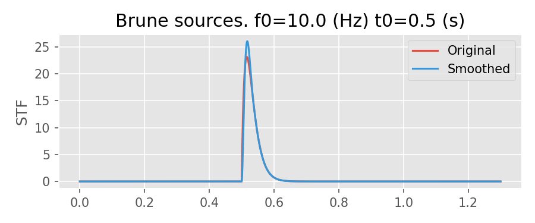
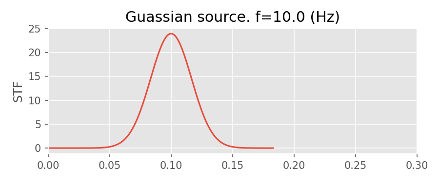

ShakerMaker is a Python framework for computing earthquake ground motions using the frequency-wavenumber (FK) method. It provides a complete pipeline from crustal model definition and earthquake source specification to ground motion computation and export in HDF5, NumPy, and H5DRM (Domain Reduction Method) formats. Computations are parallelized with MPI and scale from personal workstations to supercomputing clusters.

The FK method is implemented in Fortran (originally from http://www.eas.slu.edu/People/LZhu/home.html with several modifications) and interfaced with python through f2py wrappers. Classes are built on top of this wrapper to simplify common modeling tasks such as crustal model specification, generation of source faults (from simple point sources to full kinematic rupturespecifications), generating single recording stations, grids and other arrays of recording stations and stations arranged to meet the requirements of the DRM. Filtering and simple plotting tools are provided to ease model setup. 

ShakerMaker includes the Finite Fault Stochastic Process tool, (FFSP developed in Fortran), which allows for the idealization of a fault with a determined area and an associated event magnitude, with specific properties of strike, dip, and rake. Easy-to-use graphical functions are added for visualization of calculated metrics, as well as the determined statistics of the stochastic space performed to select the best model.

Finally, computation of motion traces is done by pairing all sources and all receivers, which is parallelized using MPI. This means that ShakerMaker can run on simple personal computers all the way up to large supercomputing clusters. 

---

## Key Features

- **FK ground motion synthesis** — full-wavefield Green's functions in 1D layered viscoelastic media
- **Domain Reduction Method (DRM)** — compute boundary motions for sub-domain simulations; export directly to H5DRM format (See H5DRMLoadPattern https://github.com/OpenSees/OpenSees)
- **Stochastic finite fault ruptures (FFSP)** — generate spatially-correlated slip distributions with the Finite Fault Stochastic Process tool (Fortran 90); uses magnitude-area scaling relations and configurable random seeds
- **Source time functions** — Brune pulse, Gaussian pulse, Dirac delta, discrete arbitrary functions, and SRF2 format
- **Pre-packaged crustal models** — LOH.1 (SCEC), Southern California (low-frequency), and AbellThesis; extendable with custom 1D layered models
- **Multiple receiver geometries** — individual stations, surface grids, DRM boxes, and point clouds
- **MPI parallelism** — `mpi4py`-based parallelization over source–receiver pairs
- **Filtering and plotting** — low-pass/high-pass filtering, ZENT three-component seismogram plots, station and source geometry plots

---

## How It Works

The FK method computes the complete seismic wavefield for a point source embedded in a 1D layered halfspace. ShakerMaker organises the workflow into three components:

| Component | Role |
|---|---|
| **CrustModel** | Defines the 1D velocity structure: layer thickness, Vp, Vs, density, and Q factors |
| **Source** | Earthquake source: a `PointSource` (single point with strike/dip/rake) or an `FaultSource` (collection of point sources forming an extended fault), optionally driven by a `SourceTimeFunction` |
| **Receiver** | Recording location: `Station` (single point), `StationList` (collection), `DRMBox` (3D box for DRM), `SurfaceGrid` (regular grid), or `PointCloudDRMReceiver` (arbitrary points) |

These three are combined into a `ShakerMaker` instance and dispatched via `.run()` (sequential) or `.gen_pairs()` → `.compute_gf()` → `.run_fast()` (three-stage, MPI-parallel). Results are stored in each `Station` object and optionally written to disk.

---

## Installation

For now, only though the git repo:

Use the `setup.py` script, using setuptools, to compile and install::


```bash
git clone git@github.com:jaabell/ShakerMaker.git
cd ShakerMaker
python setup.py install
```

If you dont' have sudo, you can install locally for your user with::

```bash
python setup.py install --user
```

### Dependencies

| Package | Required | Notes |
|---|---|---|
| `numpy` | Yes | |
| `scipy` | Yes | Signal processing, interpolation |
| `h5py` | Yes | HDF5 I/O |
| `f2py` | Yes | Fortran–Python interface (bundled with `numpy`) |
| `matplotlib` | No | Plotting (`ZENTPlot`, `StationPlot`, `SourcePlot`) |
| `mpi4py` | No | MPI parallelism (recommended for large simulations) |


You can get all these packages with `pip`::
```bash
sudo pip install mpi4py h5py f2py numpy scipy matplotlib
```
or, for your user::

```bash
sudo pip install --user mpi4py f2py h5py numpy scipy matplotlib
```


---

## Core Components

### CrustModel

Defines a 1D layered viscoelastic halfspace. Each layer has thickness (km), Vp (km/s), Vs (km/s), density (g/cm³), and quality factors Qp, Qs. A zero-thickness layer represents the halfspace.

```python
from shakermaker.crustmodel import CrustModel

crust = CrustModel(2)
crust.add_layer(1.0, 4.0, 2.0, 2.6, 10000., 10000.)
crust.add_layer(0.0, 6.0, 3.464, 2.7, 10000., 10000.)
```

Pre-defined models in `shakermaker.cm_library`:
- `SCEC_LOH_1()` — LOH.1 benchmark model
- `AbellThesis()` — model from Abell's thesis

### PointSource

A point earthquake source defined by its location `[x, y, z]` (km) and fault angles `[strike, dip, rake]` (degrees). Optionally accepts a `SourceTimeFunction` and an initial time offset `tt`.

```python
from shakermaker.pointsource import PointSource

source = PointSource([0, 0, 4], [90, 90, 0])
```

### FaultSource

A collection of `PointSource` objects forming an extended fault. Each sub-source can have its own location, angles, STF, and timing.

```python
from shakermaker.faultsource import FaultSource

sources = [PointSource([0, 0, 4], [90, 90, 0])]
fault = FaultSource(sources, metadata={"name": "mainshock"})
```

### Source Time Functions

Available in `shakermaker.stf_extensions`:

| STF | Description |
|---|---|
| `Brune(f0, t0)` | Brune pulse with corner frequency `f0` (Hz) and peak time `t0` (s) |
| `Gaussian(t0, freq, M0)` | Gaussian pulse; optionally its derivative for moment-rate representation |
| `Dirac(dt)` | Unit impulse at t=0, compatible with FK Green's function |
| `Discrete(t, data)` | Arbitrary user-defined time-history |
| `SRF2(srf2_file)` | Loads SRF2-format source description |

Each STF is convolved with the computed Green's function via `fftconvolve` to produce the final ground motion.

| SRF2 | Dirac |
|---|---|
|  |  |
| Brune | Gaussian |
|  |  |

### Station and StationList

A `Station` records the three-component ground motion (Z, E, N) at a single location. Results are stored internally and accessible via `get_response()`. Stations can be saved/loaded to/from `.npz` files.

```python
from shakermaker.station import Station
from shakermaker.stationlist import StationList

s = Station([0, 4, 0], metadata={"name": "station-01"})
stations = StationList([s])
```

### Receiver Geometries (`sl_extensions`)

| Class | Description |
|---|---|
| `DRMBox(origin, shape, spacing)` | 3D box of stations for DRM boundary conditions |
| `SurfaceGrid(origin, shape, spacing)` | Regular 2D grid on the free surface |
| `PointCloudDRMReceiver(points)` | Arbitrary set of DRM receiver points |


### FFSPSource

The Finite Fault Stochastic Process tool generates spatially-correlated stochastic slip distributions on a fault plane. Parameters include magnitude, fault dimensions, hypocenter location, corner frequencies, random seeds, and rise-time ratio. The source can be run independently and results exported to HDF5 or legacy FFSP text format.

```python
from shakermaker.ffspsource import FFSPSource

source = FFSPSource(
    id_sf_type=8, freq_min=0.01, freq_max=24.0,
    fault_length=30.0, fault_width=16.0,
    magnitude=6.5, strike=358.0, dip=40.0, rake=113.0,
    nsubx=256, nsuby=128,
    crust_model=crustal,
    ...
)
subfaults = source.run()
source.write_hdf5("results.h5")
```

### ShakerMaker Engine

The `ShakerMaker` class orchestrates the simulation:

```python
from shakermaker.shakermaker import ShakerMaker

model = ShakerMaker(crust, fault, stations)
model.run(dt=0.005, nfft=2048, dk=0.1, tb=500)
```

Key parameters:
- `dt` — output time step (s)
- `nfft` — number of frequency samples
- `dk` — wavenumber discretisation
- `tb` — initial zero-padding samples
- `smth` — smoothing flag
- `writer` — `StationListWriter` instance for direct HDF5 output

The three-stage pipeline (`gen_pairs()` → `compute_gf()` → `run_fast()`) separates pair generation from computation, enabling MPI-parallel execution.

### Output Writers (`slw_extensions`)

| Writer | Format | Use case |
|---|---|---|
| `DRMHDF5StationListWriter` | H5DRM | DRM boundary motions for external solvers |

### Plotting Tools (`tools.plotting`)

- `ZENTPlot(station, xlim, show)` — three-component seismogram overlay (Z, E, N)
- `StationPlot(stations)` — station geometry visualisation
- `SourcePlot(source)` — source geometry visualisation

---

## Examples

The `examples/` folder contains a sequentially numbered set of scripts (0–9)
plus supplementary demos in `cloud_points/` and `other_utils/`.

| # | Script | What it shows |
|---|--------|--------------|
| 0 | `example0_readme_example.py` | Two-layer crust, strike-slip point source, single station, `ZENTPlot` |
| 1 | `example1_simple.py` | Pre-packaged LOH.1 crust, shallow source, filter parameters |
| 2 | `example2_LOH1.py` | Gaussian STF, LOH.1-style source, 3 stations, saves `.npz` per station |
| 3 | `example3_drm.py` | DRM box with `DRMHDF5StationListWriter`, writes `motions.h5drm` |
| 4 | `example4_save_station.py` | Custom crust, thrust mechanism, saves station to `mystation.npz` |
| 5 | `example5_load_station.py` | Loads `.npz` back into a `Station`, interactive plot |
| 6 | `example6_explore_green.py` | Direct `subgreen()` call — explore Green's functions with multi-offset |
| 7 | `example7_drm_vs_direct.py` | Toggle `do_DRM` to compare DRM vs direct at a single point |
| 8 | `example8_ffsp.py` | FFSP stochastic finite fault rupture (Mw 6.5), writes `.h5` + ASCII |
| 9 | `example9_stf.py` | Gallery of all 5 STF types; saves figures to `docs/source/images/` |
| — | `cloud_points/cp01`–`cp06` | Station-array pattern demos (DRM box, surface grid, cross, line, circle, random) |
| — | `other_utils/build_h5drm_from_sw4_case.py` | Build `.h5drm` from an SW4 case directory |

> A detailed reference is maintained in [`examples/readme_pxp.md`](examples/readme_pxp.md).

### Example 0: Quick Start

A two-layer crustal model with a strike-slip point source at 4 km depth
and a single receiver 5 km north. Results plotted with `ZENTPlot`.

[`examples/example0_readme_example.py`](examples/example0_readme_example.py)

```python
from shakermaker.shakermaker import ShakerMaker
from shakermaker.crustmodel import CrustModel
from shakermaker.pointsource import PointSource
from shakermaker.faultsource import FaultSource
from shakermaker.station import Station
from shakermaker.stationlist import StationList
from shakermaker.tools.plotting import ZENTPlot

crust = CrustModel(2)
crust.add_layer(1.0, 4.0, 2.0, 2.6, 10000., 10000.)
crust.add_layer(0.0, 6.0, 3.464, 2.7, 10000., 10000.)

source = PointSource([0, 0, 4], [90, 90, 0])
fault = FaultSource([source], metadata={"name": "single-point-source"})

s = Station([0, 4, 0], metadata={"name": "a station"})
stations = StationList([s], metadata=s.metadata)

model = ShakerMaker(crust, fault, stations)
model.run()

ZENTPlot(s, xlim=[0, 60], show=True)
```

---

### Example 1: Simple LOH.1 Model

Uses the pre-packaged SCEC LOH.1 crustal model with a shallow source at
1 km depth. Demonstrates filter parameters and custom output settings
(`dt`, `nfft`, `dk`, `tb`).

[`examples/example1_simple.py`](examples/example1_simple.py)

```python
from shakermaker import shakermaker
from shakermaker.cm_library.LOH import SCEC_LOH_1
from shakermaker.pointsource import PointSource
from shakermaker.faultsource import FaultSource
from shakermaker.station import Station
from shakermaker.stationlist import StationList
from shakermaker.tools.plotting import ZENTPlot

crust = SCEC_LOH_1()
source = PointSource([0, 0, 1.0], [0., 45., 0.])
fault = FaultSource([source], metadata={"name": "source"})
s = Station([1., 1., 0.],
    metadata={"name": "Your House", "filter_results": True,
              "filter_parameters": {"fmax": 10.}})
stations = StationList([s], metadata=s.metadata)

model = shakermaker.ShakerMaker(crust, fault, stations)
model.run(dt=0.005, nfft=2048, dk=0.1, tb=500)
ZENTPlot(s, show=True, xlim=[0, 3])
```

---

### Example 2: LOH.1 with Gaussian STF

Three stations at varying distances and depths from a strike-slip source
with a Gaussian source time function. Stations saved individually to `.npz`.

[`examples/example2_LOH1.py`](examples/example2_LOH1.py)

```python
from shakermaker.stf_extensions.gaussian import Gaussian

stf = Gaussian(t0=0.36, freq=1/0.06, M0=1e18/5e14/2, derivative=False)
source = PointSource([0, 0, 2.0], [0., 90., 0.], stf=stf)

s1 = Station([8.0, 8.0, 0.0], metadata={"name": "sta01", "save_gf": True})
s2 = Station([6.0, 8.0, 0.0], metadata={"name": "sta02", "save_gf": True})
s3 = Station([4.0, 4.0, 0.5], metadata={"name": "sta03", "save_gf": True})
stations = StationList([s1, s2, s3], {})

model = shakermaker.ShakerMaker(crust, fault, stations)
model.run(dt=0.005, nfft=4096, tb=20, smth=1, dk=0.025, verbose=True)

s1.save("sta01.npz")
```

---

### Example 3: DRM Box with Brune STF

Defines a DRM box with 10×10×4 stations around a strike-slip source at
1 km depth. Uses a Brune STF at 2 Hz and writes results directly to
`motions.h5drm`.

[`examples/example3_drm.py`](examples/example3_drm.py)

```python
from shakermaker.slw_extensions import DRMHDF5StationListWriter
from shakermaker.sl_extensions import DRMBox

stf = Brune(f0=2., t0=0.)
source = PointSource([0, 0, 1.0], [0., 90., 0.], tt=0, stf=stf)
fault = FaultSource([source], metadata={"name": "fault"})

crust = CrustModel(1)
crust.add_layer(0., 6.0, 3.5, 2.7, 10000., 10000.)

fmax = 10.
drm = DRMBox([10., 10., 0.], [10, 10, 4],
             [3.5/fmax/15]*3,
             metadata={"name": "example3"})

writer = DRMHDF5StationListWriter("motions.h5drm")
model = shakermaker.ShakerMaker(crust, fault, drm)
model.run(dt=1/(2*fmax), nfft=2048, tb=500, dk=0.1, writer=writer)
```

---

### Example 4: Save Stations to NPZ

Builds a custom crust, runs a thrust-fault source at 1 km depth, and
saves the computed ground motion to a `.npz` file.

[`examples/example4_save_station.py`](examples/example4_save_station.py)

```python
model.run(dt=0.05, nfft=4096//8, dk=0.02, tb=100)
s.save("mystation.npz")
ZENTPlot(s, show=True)
```

---

### Example 5: Load Stations from NPZ

Loads a previously saved `.npz` file back into a `Station` and
visualises the three-component seismogram.

[`examples/example5_load_station.py`](examples/example5_load_station.py)

```python
from shakermaker.station import Station
from shakermaker.tools.plotting import ZENTPlot

s = Station()
s.load("mystation.npz")
ZENTPlot(s, show=True)
```

---

### Example 6: Direct Green's Function Exploration

Calls `shakermaker.core.subgreen` directly to explore how Green's
functions vary with small source–receiver offset perturbations.
Useful for understanding the FK engine internals.

[`examples/example6_explore_green.py`](examples/example6_explore_green.py)

```python
from shakermaker.core import subgreen

tdata, z, e, n, t0 = subgreen(
    mb, src, rcv, stype, updn,
    d, a, b, rho, qa, qb,
    dt, nfft, tb, nx, sigma, smth,
    wc1, wc2, pmin, pmax, dk, kc, taper,
    x, pf, df, lf,
    sx, sy, rx, ry
)
```

---

### Example 7: DRM vs Direct Comparison

Toggle the `do_DRM` flag to compare boundary-method (DRM) vs direct
computation at a single station. A 30×30×12 DRM box with a Brune STF
at 20 Hz corner frequency; also plots FFT spectra.

[`examples/example7_drm_vs_direct.py`](examples/example7_drm_vs_direct.py)

```python
ZENTPlot(station, show=False, integrate=1)
ZENTPlot(station, show=False, differentiate=1)
```

---

### Example 8: FFSP Stochastic Source

Generates a Mw 6.5 stochastic finite fault rupture (256×128 subfaults
on a 30×16 km fault). Exports results to HDF5 and legacy FFSP text
format.

[`examples/example8_ffsp.py`](examples/example8_ffsp.py)

```python
from shakermaker.ffspsource import FFSPSource

source = FFSPSource(
    id_sf_type=8, freq_min=0.01, freq_max=24.0,
    fault_length=30.0, fault_width=16.0,
    magnitude=6.5, ...
)
source.run()
source.write_hdf5("results.h5")
source.write_ffsp_format("FFSP_OUTPUT")
```

---

### Example 9: STF Gallery

Plots all five ShakerMaker source time functions (Brune, Gaussian,
SRF2, Dirac, Discrete) and saves the figures to `docs/source/images/`.
The images are embedded earlier in this readme under the STF section.

[`examples/example9_stf.py`](examples/example9_stf.py)

```python
from shakermaker.stf_extensions.brune import Brune
from shakermaker.stf_extensions.gaussian import Gaussian
# ... five independent figure blocks, each writing to docs/source/images/
```

---

### Supplementary: `view-dk.py`

Batch-loads multiple `.npz` files and overlays their seismograms
in a single figure.

[`examples/view-dk.py`](examples/view-dk.py)

```python
files = glob.glob("dk*.npz")
fig = plt.figure(1)
for f in files:
    s = Station()
    s.load(f)
    ZENTPlot(s, show=False, xlim=[0, 15], fig=fig, label=f)
plt.legend()
plt.show()
```

---

### Cloud Points (`examples/cloud_points/`)

Six minimal scripts demonstrating station-array patterns used with
ShakerMaker (no model run — each prints the station count):

| File | Pattern |
|------|---------|
| `cp01_drmbox.py` | Regular 3D DRM box grid (`DRMBox`) |
| `cp02_surface_grid.py` | Regular 2D grid on the free surface |
| `cp03_cross_array.py` | Cross-shaped surface array (two perpendicular lines) |
| `cp04_line_array.py` | Linear surface array |
| `cp05_circular_array.py` | Ring / circular array |
| `cp06_pointcloud.py` | Random irregular station distribution |

### Other Utilities (`other_utils/`)

| File | Purpose |
|------|---------|
| `build_h5drm_from_sw4_case.py` | Build an `.h5drm` file from an SW4 case directory; supports coordinate conversion from SW4-local km to ShakerMaker/UTM km |

---

## ShakerMaker Results

[**ShakerMaker Results**](https://github.com/ppalacios92/ShakerMakerResults) is a companion library for interactive visualisation of the HDF5 (`.h5`) files generated by ShakerMaker. It provides browser-based views of wave propagation, station responses, and spectral content, enabling rapid exploration of simulation outputs without writing plotting code.

---
