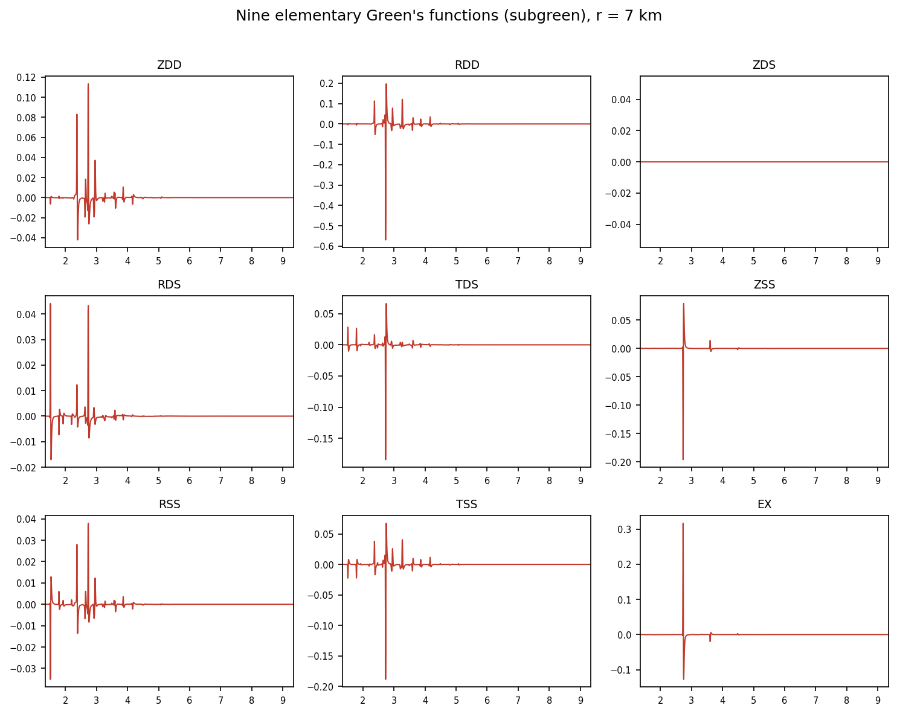
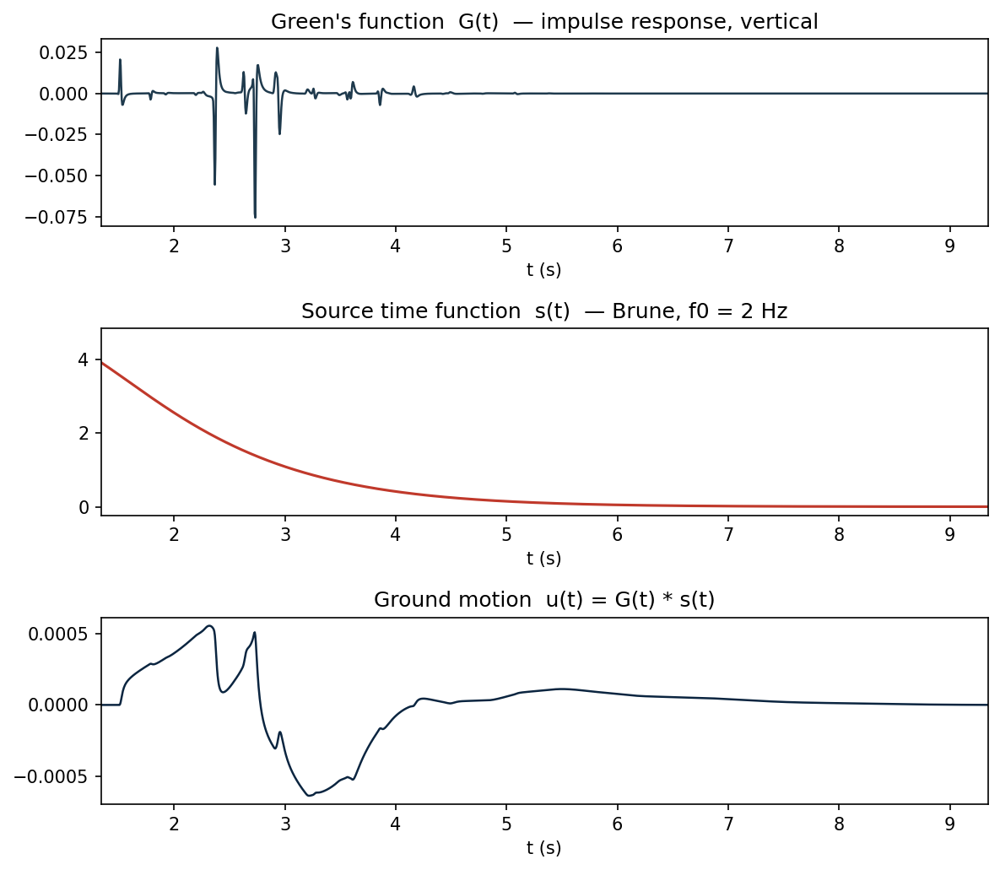

# The FK method

How ShakerMaker solves the elastic wave equation in a layered half-space. The
treatment here is at an intermediate level, the key equations and the logic of
the solution, without the full algebra. For the complete derivation see the
references.

## The idea in one line

The elastodynamic equation of motion is a second-order vector PDE in four
dimensions $(x, y, z, t)$. The FK method peels off three of those dimensions
with successive **integral transforms**, until what remains is a *first*-order
ordinary differential equation in depth $z$ alone, which a layered medium
solves exactly, layer by layer.

## The transform chain

Four nested transforms reduce the problem:

$$
\underbrace{\mathbf{u}(\mathbf{x}, t)}_{\text{4-D field}}
\;\xrightarrow{\ \mathcal{F}_t\ }\;
\underbrace{\mathbf{u}(\mathbf{x}, \omega)}_{\text{3-D Helmholtz}}
\;\xrightarrow{\ \text{cyl. harmonics}\ }\;
\underbrace{\mathbf{u}_m(r, z, \omega)}_{\text{2-D, per mode } m}
\;\xrightarrow{\ \mathcal{H}_m\ }\;
\underbrace{\mathbf{b}(z;\, k, \omega, m)}_{\text{1-D ODE}}
$$

- **Fourier in time** $t \to \omega$ turns the wave equation into a Helmholtz
  problem at each frequency.
- **Cylindrical (azimuthal) harmonics** in $\theta$ separate the angular
  dependence into modes $m$, using the orthonormal vector harmonics
  $\mathbf{R}_m^k,\ \mathbf{S}_m^k,\ \mathbf{T}_m^k$ built from the Bessel
  function $J_m(kr)$.
- **Hankel transform** in the radial distance $r \to k$ introduces the
  horizontal **wavenumber** $k$, the "wavenumber" in "frequency–wavenumber".

Each transform is invertible, so the displacement at the receiver is recovered
by the inverse Hankel ($k\,dk$) and inverse Fourier ($\omega$) integrals, the
**FK double-integral representation** of the wavefield:

$$
\mathbf{u}(r, \theta, z, t) = \frac{1}{2\pi}\sum_{m}\int e^{-i\omega t}\,d\omega
\int_0^{\infty} k\,dk\,\Big(U_z\,\mathbf{R}_m^k + U_r\,\mathbf{S}_m^k + U_\theta\,\mathbf{T}_m^k\Big)
$$

Everything in the method is the construction of the three scalar **kernels**
$U_z, U_r, U_\theta$, the depth-dependent amplitudes of the wavefield at
wavenumber $k$ and frequency $\omega$.

## The depth ODE

Collecting the displacement and depth-traction coefficients into a single
six-component **displacement–stress vector** (Zhu's ordering, matching the
Fortran `kernel.f`):

$$
\mathbf{b}(z) = \big[\,U_r,\ U_z,\ T_z,\ T_r,\ U_\theta,\ T_\theta\,\big]^{\top}
$$

inserting the harmonic expansion into the wave equation turns the PDE into a
first-order linear ODE in depth,

$$
\frac{d\,\mathbf{b}}{dz} = \mathbf{M}(z;\, k, \omega)\,\mathbf{b}.
$$

The matrix $\mathbf{M}$ is block-diagonal: the first four components
$(U_r, U_z, T_z, T_r)$ are the **P–SV** (in-plane) motion and the last two
$(U_\theta, T_\theta)$ are the **SH** (out-of-plane) motion. For an isotropic,
vertically layered medium the two blocks **decouple completely**, P–SV gives
Rayleigh waves, SH gives Love waves.

## Solving it: propagator matrices

Inside one homogeneous layer $\mathbf{M}$ is constant, so the ODE has a closed
solution. Eliminating the layer constants between the top and bottom of layer
$n$ gives the **Thomson–Haskell propagator** that maps the state vector across
the layer:

$$
\mathbf{b}_n = \mathbf{a}_n\,\mathbf{b}_{n-1}, \qquad
\mathbf{a}_n = \mathbf{E}_n\,\mathbf{\Lambda}_n(d_n)\,\mathbf{E}_n^{-1}
$$

where $\mathbf{E}_n$ holds the layer eigenvectors and $\mathbf{\Lambda}_n$
the exponential depth-dependence over the thickness $d_n$. Chaining the layers
is just matrix multiplication. The full algorithm:

1. **Initialise** at the bottom half-space with the radiation condition (only
   down-going / decaying waves).
2. **Propagate up** to the source depth.
3. **Inject the source** as a jump in $\mathbf{b}$ across the source plane.
4. **Continue up** to the receiver and the free surface.
5. **Apply the free-surface condition** (zero traction) and solve for the
   kernels.

!!! warning "Why ShakerMaker uses the *compound*-matrix form"
    The naïve Haskell product loses precision catastrophically at large $k$ or
    large depth (growing and decaying exponentials cancel). The **compound /
    Zhu–Rivera** reformulation, which ShakerMaker's Fortran kernel uses, 
    propagates $2\times2$ sub-determinants instead, staying numerically bounded,
    and unifies the static ($\omega\to 0$) and dynamic limits in one code path.

## The surface kernels

Applying the boundary conditions yields a small linear system whose solution is
the three displacement kernels in closed form:

$$
U_z(0) = \frac{N_z(\omega, k)}{F_R(\omega, k)}, \qquad
U_r(0) = \frac{N_r(\omega, k)}{F_R(\omega, k)}, \qquad
U_\theta(0) = \frac{N_\theta(\omega, k)}{F_L(\omega, k)}
$$

with the **Rayleigh denominator** $F_R$ (P–SV block) and the **Love
denominator** $F_L$ (SH block). The analytic structure of these kernels *is*
the seismogram:

| Singularity of the integrand | Physical arrival |
|---|---|
| **Branch points** at $k = \omega/V_{P,n},\ \omega/V_{S,n}$ | body waves (direct P, S, reflections) |
| **Poles** of $F_R$ at $k = k_R(\omega)$ | Rayleigh surface waves ($c_R \approx 0.92\,V_S$) |
| **Poles** of $F_L$ at $k = k_L(\omega)$ | Love surface waves |

In a purely elastic medium these poles sit *on* the real $k$-axis and the
integral diverges. Operational FK codes regularise with **both** a finite $Q$
(in the velocity model) and a small imaginary part $\sigma$ added to $\omega$, 
this is the `sigma` parameter you set at run time (see
[Numerics](numerics.md#sigma-damping-the-complex-frequency)).

## The source: nine elementary Green's functions

A general earthquake source is a **moment tensor**, a second-order tensor, so
its azimuthal expansion truncates at $|m| \le 2$. The five modes
$m=\{-2,-1,0,1,2\}$ collapse by symmetry to **three** independent ones
$m = 0, 1, 2$, which Helmberger (1983) labels **DD, DS, SS**. Three components
$(Z, R, T)$ × three modes gives **nine elementary Green's functions**, the raw
output of the Fortran `subgreen`:

{ width=640 }

*Nine elementary Green's functions for a single geometry ($r = 7$ km). The
`ZDS` panel is identically zero by symmetry. Reproduce with
[`gen_green_functions.py`](../examples/index.md#generating-the-figures).*

Crucially, these nine depend **only on the geometry** $(\Delta h, z_{\text{src}},
z_{\text{rec}})$, not on the source mechanism or azimuth. That is why
ShakerMaker stores them in geometry "slots" and reuses them, the foundation of
the [OP pipeline](../guides/running.md#the-op-pipeline-run_nearest).

## From kernels to a seismogram

Three operations turn the nine geometric functions into the recorded motion:

1. **Recombine** with the moment tensor and azimuth $\phi$. The coefficients are
   algebraic, e.g. the vertical down-dip term
   $c^Z_{DD} = \tfrac16(M_{xx} + M_{yy} - 2M_{zz})$, giving the radial/transverse
   frame $(u_Z, u_R, u_T)$.
2. **Rotate** from radial–transverse to geographic:

$$
u_E = u_R\sin\phi - u_T\cos\phi, \qquad u_R\cos\phi + u_T\sin\phi = u_N
$$

3. **Convolve** with the source time function. The kernel is the *impulse*
   response; the real waveform is $u(t) = G(t) * \dot{s}(t)$, so one Green's
   function serves any STF:

{ width=520 }

The result is the three-component velocity $(Z, E, N)$ stored on each
[`Station`](../guides/receivers.md).

## References

- Zhu, L. & Rivera, L. A. (2002). *GJI* **148**, 619–627, the unified formulation.
- Haskell, N. A. (1964). *BSSA* **54**, the layer propagator.
- Bouchon, M. (1981). *BSSA* **71**, 959–971, discrete wavenumber.
- Helmberger, D. V. (1983), the nine-function decomposition.
- Aki, K. & Richards, P. G. (2002). *Quantitative Seismology*, 2nd ed., Ch. 7, 9.

Continue to [**Numerical solution →**](numerics.md).
