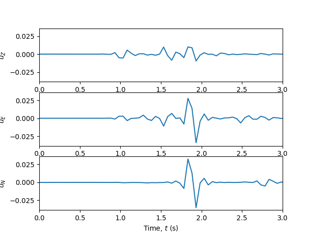

# Examples

Each script in [`examples/`](https://github.com/ppalacios92/ShakerMaker/tree/master/examples)
is a small, self-contained input → result. They are the fastest way to see
which inputs produce which output.

## Featured: read a seismogram (Example 0)

A two-layer crust, a vertical strike-slip source at 4 km depth, one station
4 km north.

```python
crust = CrustModel(2)
crust.add_layer(1.0, 4.0, 2.0, 2.6, 10000., 10000.)
crust.add_layer(0.0, 6.0, 3.464, 2.7, 10000., 10000.)
source = PointSource([0, 0, 4], [90, 90, 0])          # strike, dip, rake
sta = Station([0, 4, 0], metadata={"name": "STA01"})
model = ShakerMaker(crust, FaultSource([source], {"name": "s"}), StationList([sta]))
model.run(dt=0.005, nfft=2048, dk=0.1, tb=500)
ZENTPlot(sta, xlim=[0, 60], show=True)
```

**Result**, a three-component velocity trace with four classical arrivals
(distance $r=\sqrt{4^2+4^2}=5.66$ km):

| Arrival | Component | ≈ time |
|---|---|---|
| Direct P | Z | ~1.1 s |
| Direct S | Z, R | ~2.1 s |
| Rayleigh | Z, R | ~3.1 s |
| Love | T (strong, strike-slip) | ~3 s |

{ width=520 }

## The numbered scripts

| # | Script | Input it shows | Result |
|---|---|---|---|
| 0 | `example0_readme_example.py` | 2-layer crust, strike-slip point source | 3-comp seismogram |
| 1 | `example1_simple.py` | LOH.1 preset + filter parameters | filtered trace |
| 2 | `example2_LOH1.py` | Gaussian STF, 3 stations | per-station `.npz` |
| 3 | `example3_drm.py` | `DRMBox` + Brune STF + H5DRM writer | `motions.h5drm` |
| 4 | `example4_save_station.py` | thrust mechanism, custom crust | saved `.npz` |
| 5 | `example5_load_station.py` | load `.npz` | interactive plot |
| 6 | `example6_explore_green.py` | direct `subgreen()` call | the 9 Green's functions |
| 7 | `example7_drm_vs_direct.py` | `do_DRM` toggle | DRM vs direct overlay |
| 8 | `example8_ffsp.py` | `FFSPSource` (Mw 6.5) | stochastic rupture `.h5` |
| 9 | `example9_stf.py` | all five STFs | STF gallery figures |

## Station-array patterns (`cloud_points/`)

| Script | Layout |
|---|---|
| `cp01_drmbox.py` | 3D DRM box |
| `cp02_surface_grid.py` | 2D surface grid |
| `cp03_cross_array.py` | cross |
| `cp04_line_array.py` | line |
| `cp05_circular_array.py` | ring |
| `cp06_pointcloud.py` | random cloud |

## Other utilities

`other_utils/build_h5drm_from_sw4_case.py`, build an `.h5drm` from an SW4
case directory (with SW4-local-km ↔ ShakerMaker/UTM-km conversion).

> Full reference: [`examples/readme_pxp.md`](https://github.com/ppalacios92/ShakerMaker/blob/master/examples/readme_pxp.md).

## Generating the figures

Every figure in this documentation is produced by a small, comment-free
script under `docs/web/examples/scripts/`. They double as **minimal,
copy-pasteable recipes** for the most common tasks, and as a regression
check that the API still behaves. All are fast (the heaviest is a reduced
FFSP); none needs MPI.

| Script | Produces | Demonstrates |
|---|---|---|
| `gen_crust_profiles.py` | `crust_loh1`, `crust_basin` | `CrustModel.plot_profile()` |
| `gen_stf_gallery.py` | `stf_overview` | STF time domain + spectrum |
| `gen_station_geometry.py` | `geom_surface_grid`, `geom_drmbox`, `geom_hollow_box` | `SurfaceGrid` modes, `DRMBox`, `StationPlot` |
| `gen_seismogram.py` | `seismogram_velocity/displacement/acceleration` | a full FK run + `ZENTPlot` |
| `gen_green_functions.py` | `green_functions_9` | the nine elementary GFs via `subgreen` |
| `gen_convolution.py` | `convolution` | Green's function ∗ STF |
| `gen_ffsp.py` | `ffsp_slip`, `ffsp_rise_time` | a small stochastic `FFSPSource` |

Run one (or all):

```bash
cd docs/web/examples/scripts
python gen_seismogram.py
# or regenerate everything:
python gen_all.py
```

The scripts save straight into `docs/web/assets/images/`, so the docs pick up
the refreshed figures on the next build.
