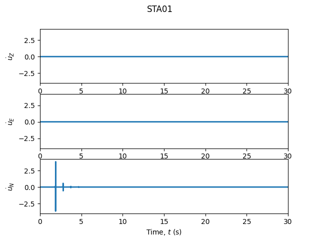
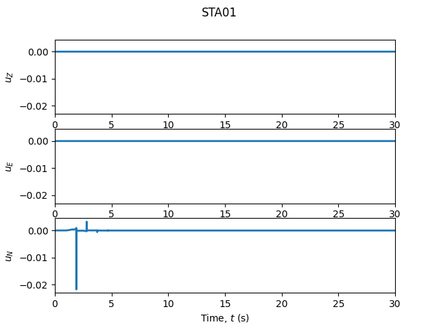
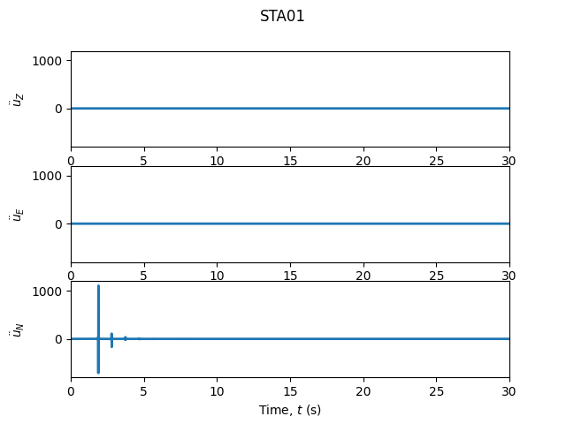

# Exercise 1: First run & the four arrivals

**Goal.** Run the complete FK pipeline end to end and identify the four
classical seismic arrivals in the output.

## The model

A two-layer crust (1 km soft layer over a half-space), a vertical
strike-slip source at 4 km depth, and one surface station 4 km north.

```python
from shakermaker.shakermaker import ShakerMaker
from shakermaker.crustmodel import CrustModel
from shakermaker.pointsource import PointSource
from shakermaker.faultsource import FaultSource
from shakermaker.station import Station
from shakermaker.stationlist import StationList
from shakermaker.tools.plotting import ZENTPlot

# --- Medium: 1 km soft layer over a half-space ---
crust = CrustModel(2)
crust.add_layer(1.0, 4.0, 2.0,   2.6, 10000., 10000.)   # d, vp, vs, rho, Qp, Qs
crust.add_layer(0.0, 6.0, 3.464, 2.7, 10000., 10000.)   # half-space (d = 0)

# --- Source: vertical strike-slip at 4 km depth ---
source = PointSource([0, 0, 4], [90, 90, 0])            # [strike, dip, rake]
fault  = FaultSource([source], metadata={"name": "single-point-source"})

# --- Receiver: surface station 4 km north ---
sta = Station([0, 4, 0], metadata={"name": "STA01"})
stations = StationList([sta], metadata=sta.metadata)

# --- Run ---
model = ShakerMaker(crust, fault, stations)
model.run(dt=0.005, nfft=2048, dk=0.1, tb=500)

ZENTPlot(sta, xlim=[0, 60], show=True)
```

## What you should see

A three-component velocity seismogram (Z, E, N). With source–receiver
distance $r=\sqrt{4^2+4^2}=5.66$ km, four arrivals appear in order:

| Arrival | Component | Approx. time | Why |
|---|---|---|---|
| Direct **P** | Z (first) | $t_P = r/V_P \approx 1.1$ s | fastest body wave |
| Direct **S** | Z, R (larger) | $t_S = r/V_S \approx 2.1$ s | slower, stronger |
| **Rayleigh** | Z, R (late) | $t_R \approx r/(0.92\,V_S) \approx 3.1$ s | surface wave, elliptical motion |
| **Love** | T (strong) | $\sim 3$ s | SH guided by the soft layer |

The **strike-slip** mechanism radiates strongly on the transverse (`T`)
component, that is the signature of `[90, 90, 0]`.

{ width=620 }

Integrating gives displacement, differentiating gives acceleration:

| Displacement (`integrate=1`) | Acceleration (`differentiate=1`) |
|---|---|
|  |  |

*Reproduce with [`gen_seismogram.py`](../examples/index.md#generating-the-figures).*

## Things to try

1. **Change the mechanism** to dip-slip `[0, 45, 90]`, the energy moves to
   the radial/vertical components and `T` weakens.
2. **Move the station** farther (`[0, 12, 0]`), every arrival time scales
   with $r$; the gaps between P, S and the surface waves widen.
3. **Integrate / differentiate** the trace:
   ```python
   ZENTPlot(sta, integrate=1, show=True)      # velocity → displacement
   ZENTPlot(sta, differentiate=1, show=True)  # velocity → acceleration
   ```

## Checkpoint

You can identify P, S, Rayleigh and Love on the plot, and you can predict how
their times change when you move the station. Next:
[numerical convergence](02_convergence.md).
