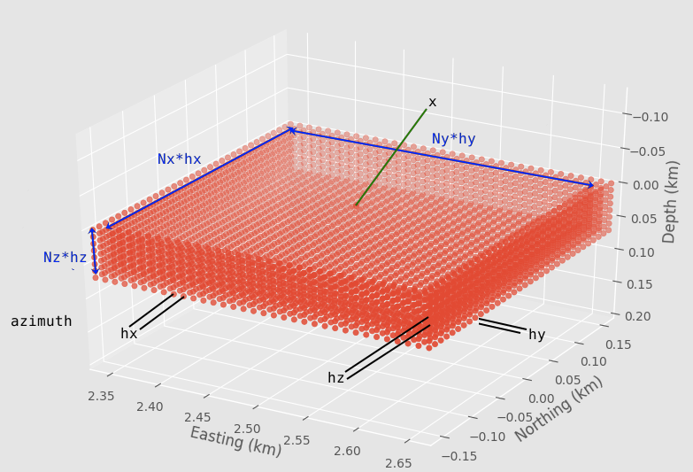

# Domain Reduction Method (DRM)

The DRM couples a regional FK simulation to a local detailed model. ShakerMaker
computes the boundary motions; a finite-element/-difference solver (OpenSees,
SW4) consumes them. For the full hands-on workflow see
[Exercise 5](../exercises/05_drm.md).

## Why DRM

Simulating an entire region at the resolution a building site needs is
intractable. The DRM (Bielak et al., 2003) splits the problem: the
**free-field** wavefield is computed cheaply over a regional 1-D model with
FK, captured on a **box** of receivers surrounding the site, and then injected
on that box as an equivalent boundary load that drives the local nonlinear
model, with the local model adding only the *scattered* field.

{ width=460 }

## Defining the box: `DRMBox`

```python
from shakermaker.sl_extensions import DRMBox

fmax = 10.0
h    = 3.5 / fmax / 15
drm  = DRMBox([10., 10., 0.], [10, 10, 4], [h, h, h],
              metadata={"name": "site"}, azimuth=0.)
```

`DRMBox(pos, nelems, h, metadata={}, azimuth=0.)`:

| Arg | Meaning |
|---|---|
| `pos` | box **centre** `[x, y, z]` (km) |
| `nelems` | station counts `[Nx, Ny, Nz]` |
| `h` | spacings `[hx, hy, hz]` (km) |
| `azimuth` | box orientation (deg) |

Side lengths: interior `[Nx·hx, Ny·hy, Nz·hz]`; exterior boundary adds a ring,
`[(Nx+2)·hx, (Ny+2)·hy, (Nz+1)·hz]`. Choose `h ≈ Vs / fmax / 15` to resolve
the band, and `dt ≈ 1/(2·fmax)` for Nyquist.

## Running and writing H5DRM

```python
from shakermaker.slw_extensions import DRMHDF5StationListWriter

writer = DRMHDF5StationListWriter("motions.h5drm")
model  = ShakerMaker(crust, fault, drm)
model.run(dt=1/(2*fmax), nfft=2048, tb=500, dk=0.1, writer=writer)
```

The writer streams results to disk as they are computed (O(1) memory), so very
large boxes are feasible.

## The H5DRM file

```
/Coordinates    (n_nodes, 3)        node positions (km)
/Time           (nt,)               time vector (s)
/Velocity       (n_nodes, nt, 3)    three-component velocity
/Displacement   (n_nodes, nt, 3)
/Acceleration   (n_nodes, nt, 3)
/DRM_Information group               box dimensions, boundary index
```

Inspect with `h5ls -r motions.h5drm` or `h5dump -H motions.h5drm`.

## Consuming the motions

- **OpenSees**, the `H5DRMLoadPattern` reads the file directly and applies
  the DRM boundary forces. This is the de-facto FK→FE coupling standard.
- **From an SW4 case**, `other_utils/build_h5drm_from_sw4_case.py` builds an
  `.h5drm` from an SW4 run, with SW4-local-km ↔ ShakerMaker/UTM-km conversion.
- **Geometry only**, `model.export_drm_geometry("drm_geometry.h5drm")` writes
  the box geometry without running the simulation.

## Validation

`example7_drm_vs_direct.py` toggles `do_DRM` to confirm that the DRM-injected
motion matches a direct FK computation at the same point, within the tolerance
set by `sigma` and `dk`.

## Reference

[Receivers → DRMBox](receivers.md) · [ShakerMaker engine API](../api/shakermaker.md)
